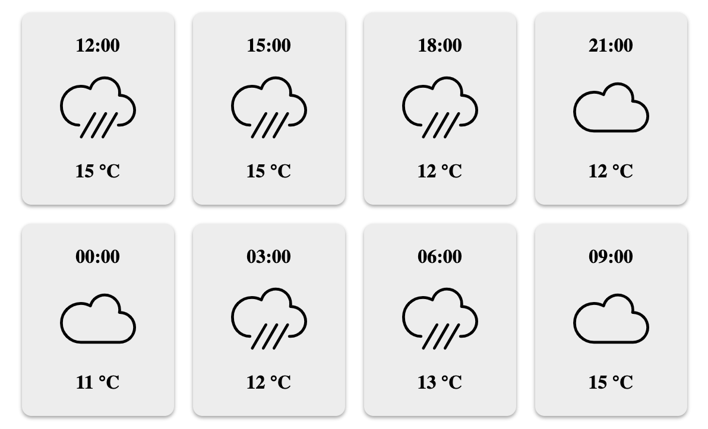

# Weatherapp exercise

## Steps to set dev environment up:

- clone or download this repository
- `npm install` all dependencies
- create .env file containing [openweathermap](https://openweathermap.org/) APPID in the backend directory
- run command `docker-compose up` in the root directory
- open http://localhost:8000/ and http://localhost:9000/api/weather in the browser
- start developing :)

